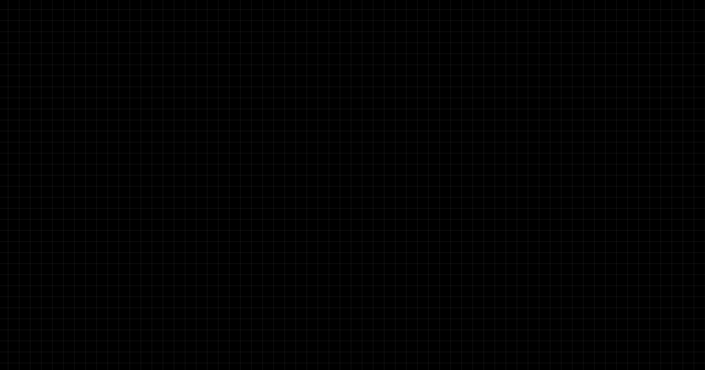
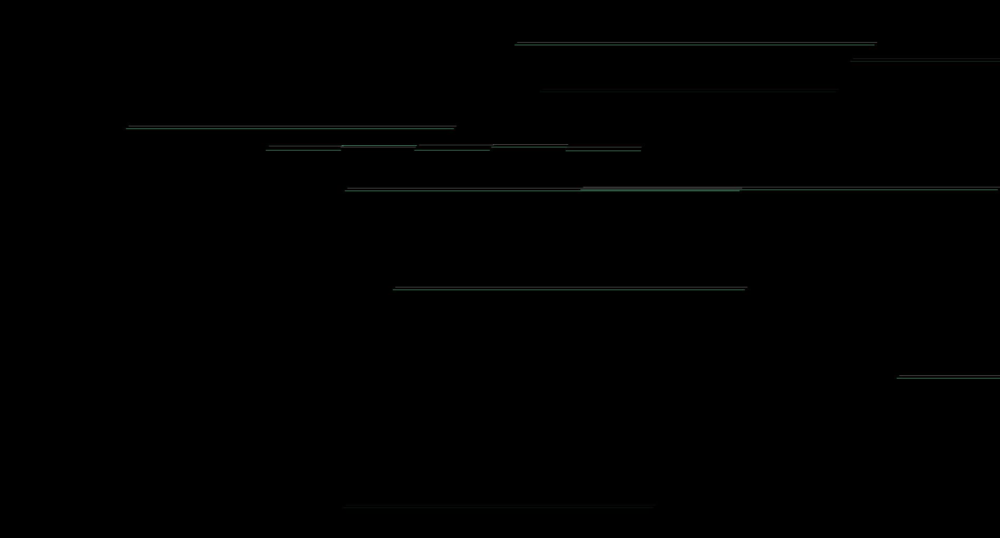
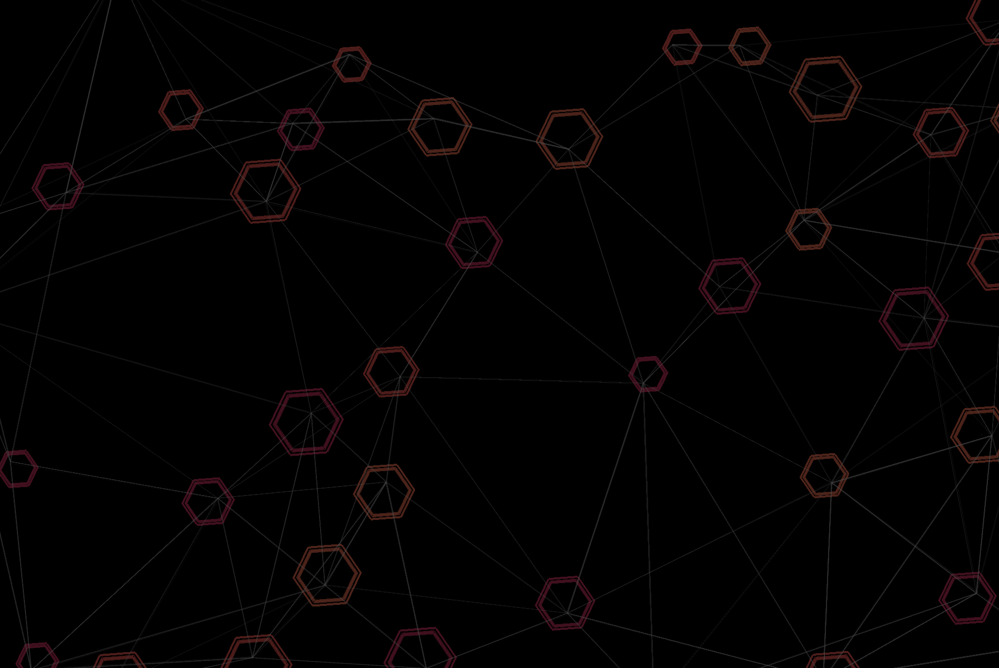
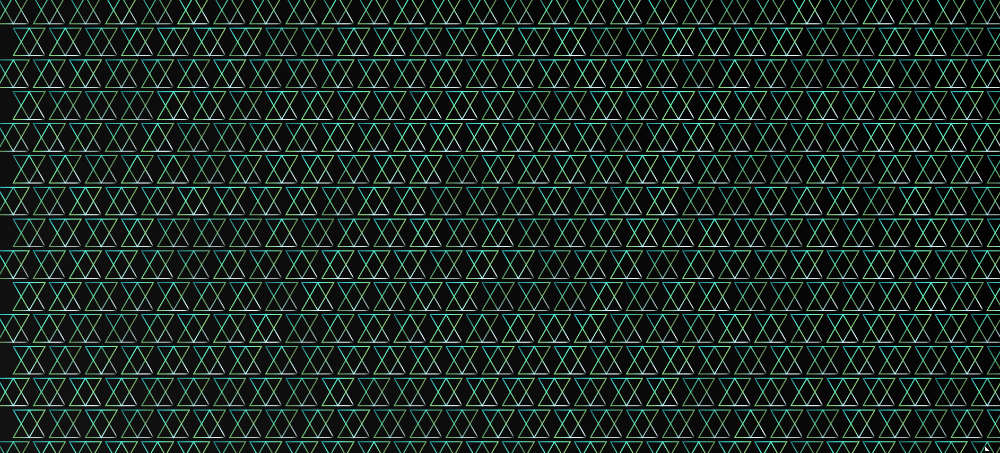
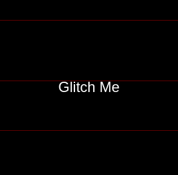
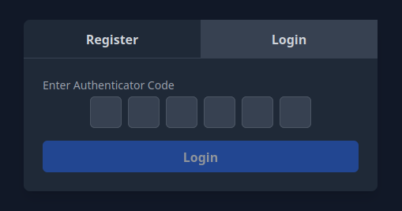
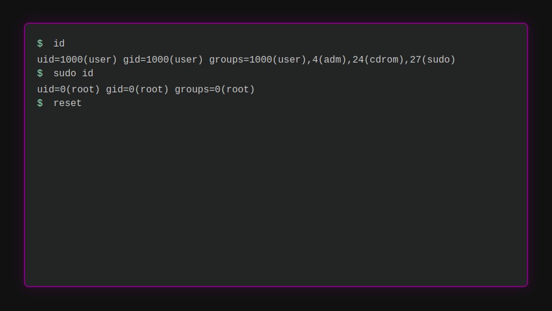

# Cool-ui

A place where I will be publishing some of the most creative, modern and sleek UI designs, animations and effects for websites.

Every directory contains a different design and all of them can very easily be incorporated in your own projects with minimal effort. They can be applied to any elements such as the following and many more:
- `<body>` background in HTML
- `<container>` backgrounds in bootstrap 5
- `<segment>` background in Semantic UI
- `<template>` background in vue

These are just some examples of where my animations have been tested but I usually created modular tools so you can use them anywhere. 

## A few demos

| Round rotating binary | Pulse graph |
|--------|--------|
|  |  |

| Double glitch lines | Moxing hexagonal network |
|--------|--------|
|  |  |

### Binary animation

This is the type of animation that you can apply on a round image, for example it could look great if applied to your Cyebersecurity company logo:  

  

### Graph animation 

You can use this background in various ways, whether you want to create a futuristic animation for demonstrating a CTF or a calm dark background, you can use this graph:

  

### Hallucination animation

If you are looking for an animation that could keep people looking more than just a few seconds, this is something you should use:

  

### Hexagonal network

This animation only works on chrome.
If you are looking for modern background that keeps changing on every load, this is something you should look into:

  

### Laser animation for images

This animation was specifically created for images but it can be applied to any other elements. If you have got an image of the Matrix and want to add glitching effect on top of it, this is something you should consider using:

  

### Login & Register form

This is a Tailwindcss multi-step register & login page with everything included such as password fields, email, modern OTP fields and more. 

  

### Background glitch lines

If you are looking for a cyberpunk-style animation, this is something you should definetly look into:

  

### Terminal commands

This is a Linux terminal animation, certain commands are entered in loop and their output is displayed. It could be used on Hero section of a website. 

