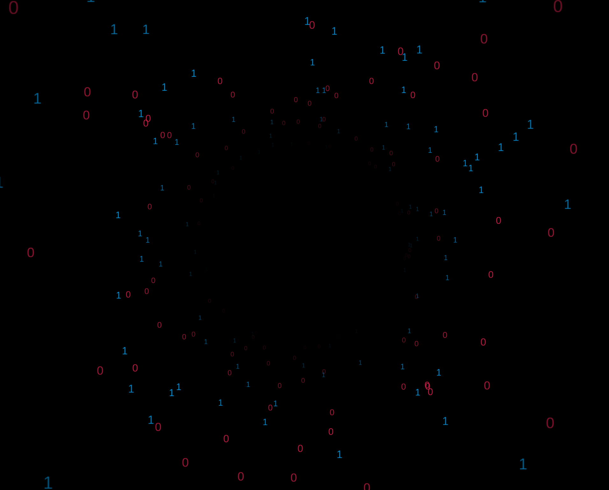

# Cool-ui

A place where I will be publishing some of the most creative, modern and sleek UI designs, animations and effects for websites.

Every directory contains a different design and all of them can very easily be incorporated in your own projects with minimal effort. They can be applied to any elements such as the following and many more:
- `<body>` background in HTML
- `<container>` backgrounds in bootstrap 5
- `<segment>` background in Semantic UI
- `<template>` background in vue

These are just some examples of where my animations have been tested but I usually created modular tools so you can use them anywhere. 

## A few demos

| Round rotating binary | Pulse graph |
|--------|--------|
|  |  |

| Double glitch lines | Moxing hexagonal network |
|--------|--------|
|  |  |

### Binary animation

This is the type of animation that you can apply on a round image, for example it could look great if applied to your Cyebersecurity company logo:  

[Binary animation](./binary-round-background/)
  

### Graph animation 

You can use this background in various ways, whether you want to create a futuristic animation for demonstrating a CTF or a calm dark background, you can use this graph:

[Graph animation](./graph-background/)
  

### Hallucination animation

If you are looking for an animation that could keep people looking more than just a few seconds, this is something you should use:

[Hallucination animation](./hallucinate/)
  

### Hexagonal network

This animation only works on chrome.
If you are looking for modern background that keeps changing on every load, this is something you should look into:

[Hexagonal network animation](./hexagon-background/)
  

### Laser animation for images

This animation was specifically created for images but it can be applied to any other elements. If you have got an image of the Matrix and want to add glitching effect on top of it, this is something you should consider using:

[Laser animation for images](./laser-animation/)
  

### Login & Register form

This is a Tailwindcss multi-step register & login page with everything included such as password fields, email, modern OTP fields and more. 

[Login & Register form template](./login-register-form/)
  

### Background glitch lines

If you are looking for a cyberpunk-style animation, this is something you should definetly look into:

[Background glitch lines](./background-line-glitch/)
  

### Terminal commands

This is a Linux terminal animation, certain commands are entered in loop and their output is displayed. It could be used on Hero section of a website. 

[Terminal commands animation](./terminal-commands/)
  

### Navbar + Sidebar
If you are looking to create a course and your course is going to have several sections, you may want to make all sections easily accessible to user with a sidebar. 

[Navbar & Sidebar template](./top-nav-and-sidebar/)
  

### Rainbow background animation
If you are looking for a screen-saver-like background, this is it:

[Rainbow animation](./rainbow-traingles/)
  

### Blog sidebar
This may be the perfect starter template for creating your own solo or team blog, it was written in DaisyUI:

[Blog sidebar template](./blog-sidebar/)
  

### Wave animation

If you are interested in creating a wave made up of dots that just keeps moving, you may want to check this out:

[Wave animation](./wave-animation/)
  

### Particles

Particles go without explanation but I have created several other types of particles that you can find by browsing "[Sweet Particles](https://github.com/0xHamy/sweet_particles/)" repository.

  

## Integration
All of these animations are quite easy to implement & integrate with any existing website that you have. If you face any problems that can't be solved by your AI friends, please open an issue. 

